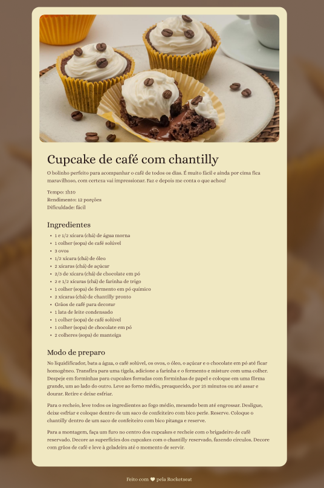

<h1 align="center"> Receitas Cupcake </h1>

Desafio para iniciantes em programação com HTML E CSS  

  

## 🚀 Tecnologias

Esse projeto foi desenvolvido com as seguintes tecnologias:

- HTML e CSS
- Git e Github

 https://viniciusgcampanella.github.io/projeto.receitacup/ 
